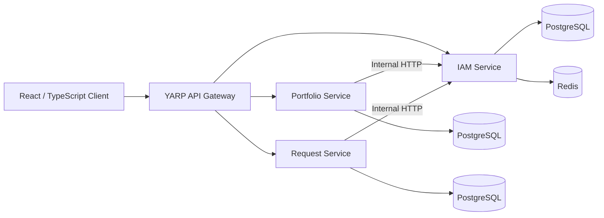

# Design Nexus

Design Nexus is a collaborative full-stack platform for connecting clients with designers, built with a service-oriented **ASP.NET Core backend** and a **React/TypeScript frontend**.

The project was originally developed as a **team project**. The original Git history has been preserved so the contributions of both developers remain visible.

My primary responsibility was the **backend and infrastructure side** of the project, including authentication, backend services, persistence, API gateway configuration, service integration, and Dockerization.

## Highlights

- ASP.NET Core backend split into IAM, Portfolio, and Request services
- YARP API Gateway as the main backend entry point
- JWT authentication and refresh-token flow
- OTP verification backed by Redis
- PostgreSQL and Entity Framework Core
- Portfolio and designer-profile management
- Project-request workflow between clients and designers
- Media/file handling for portfolio content
- Internal HTTP communication between backend services
- Docker and Docker Compose support
- React + TypeScript frontend

## Architecture



For a deeper technical explanation, see [Architecture Documentation](docs/architecture.md).

## My Contributions

My primary responsibility in Design Nexus was backend development and infrastructure.

My work included:

- Designing and implementing the initial backend structure
- Building the IAM service and authentication flows
- Implementing JWT authentication, refresh tokens, OTP verification, and password recovery
- Integrating Redis for temporary OTP storage
- Integrating PostgreSQL through Entity Framework Core
- Creating and maintaining backend migrations
- Implementing the YARP API Gateway
- Developing major parts of the Portfolio service
- Implementing designer profiles, portfolio creation, retrieval, update, categories, and media handling
- Developing major parts of the Project Request service
- Implementing request creation, validation, retrieval, and status updates
- Implementing internal HTTP communication between services
- Creating Dockerfiles for backend services and the Gateway
- Contributing to Docker Compose configuration and service networking
- Resolving backend/frontend integration issues such as CORS, routing, and API addresses
- Refactoring and debugging backend functionality throughout development

The project was developed collaboratively, and the frontend and other parts of the application contain substantial contributions from the other team member.

## Tech Stack

**Backend:** C#, ASP.NET Core, Entity Framework Core, PostgreSQL, Redis, MediatR, YARP, JWT, BCrypt, MailKit, Swagger/OpenAPI, xUnit, Moq

**Frontend:** React, TypeScript, Vite

**Infrastructure:** Docker, Docker Compose, Nginx, Git/GitHub

## Repository Structure

```text
design-nexus/
├── Backend/
│   ├── src/
│   │   ├── gateway/
│   │   └── services/
│   │       ├── iam/
│   │       ├── portfolio/
│   │       └── request/
│   ├── docker-compose.yml
│   └── README.md
├── Frontend/
│   ├── src/
│   └── README.md
├── docs/
│   └── architecture.md
└── README.md
```

## Documentation

- [Backend Documentation](Backend/README.md)
- [Frontend Documentation](Frontend/README.md)
- [Architecture Documentation](docs/architecture.md)

## Team

Design Nexus was developed collaboratively by:

- **Mostafa Nasrollahpour** — primarily backend development and infrastructure
- **[@EslamiRaziyeh84](https://github.com/EslamiRaziyeh84)** — frontend and collaborative project development

The original Git history has intentionally been preserved so the contribution history remains transparent.

## Project Status

**Completed Team / Portfolio Project**

The current focus of this repository is documentation, repository cleanup, and portfolio presentation rather than active feature development.

The project was not built as a production deployment. Configuration, testing, security, and deployment concerns should be reviewed before using the code outside a development or learning environment.
