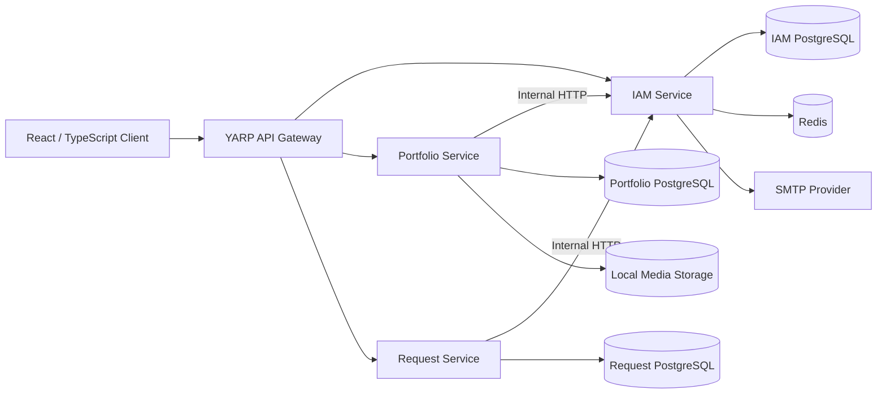

# Design Nexus Architecture

This document describes the backend architecture and the main technical decisions used in Design Nexus.

Design Nexus was developed as a collaborative team project. The architecture reflects the requirements and scope of that project rather than an attempt to build a large-scale enterprise platform.

## System Overview

The system consists of:

- React/TypeScript frontend
- YARP API Gateway
- IAM service
- Portfolio service
- Request service
- PostgreSQL databases
- Redis
- SMTP email delivery
- Local media storage



## Architectural Style

The backend uses a small service-oriented / microservice-style structure.

The main domains are separated because they have different responsibilities:

- identity and authentication
- designer portfolios
- project requests

Each service owns its own persistent data and exposes functionality through an ASP.NET Core API.

The project intentionally avoids adding distributed-system infrastructure only for architectural appearance. Technologies such as Kafka, RabbitMQ, Kubernetes, service meshes, and event sourcing were not required for the original scope.

## API Gateway

The API Gateway is implemented with YARP.

Its responsibility is to route external application traffic to the correct backend service:

```text
Client
  |
  v
Gateway
  |
  +--> IAM
  +--> Portfolio
  +--> Request
```

For this project, the Gateway provides one backend-facing address for the frontend and centralizes route configuration.

## IAM Service

IAM owns identity-related functionality:

- registration
- login
- password hashing
- JWT generation
- refresh tokens
- OTP verification
- password recovery
- user updates
- authentication and authorization

IAM owns a PostgreSQL database for persistent data.

Redis is used for temporary data such as OTP values, and SMTP/MailKit is used for email delivery.

## Portfolio Service

Portfolio owns:

- designer profiles
- portfolios
- portfolio items
- categories
- portfolio creation and updates
- portfolio retrieval
- recent portfolio queries
- category-based filtering
- media/file management

Portfolio owns its own PostgreSQL database.

When user/designer information is required, Portfolio communicates with IAM over HTTP instead of reading IAM's database directly.

## Request Service

Request owns:

- project-request creation
- designer assignment
- deadlines
- category validation
- requester-specific request views
- designer-specific request views
- request status changes
- authorization checks

Request owns its own PostgreSQL database and communicates with IAM when identity information is required.

## Service Boundaries and Data Ownership

```text
IAM
  owns users and authentication-related data

Portfolio
  owns designer profiles, portfolios, categories and media references

Request
  owns project requests and request status
```

Cross-service access should happen through APIs rather than direct cross-database queries.

## Internal Communication

Service-to-service communication currently uses synchronous HTTP:

```text
Portfolio --------> IAM
          HTTP

Request ----------> IAM
          HTTP
```

For the scale of the project, this keeps the design understandable and avoids introducing infrastructure without a concrete use case.

The trade-off is runtime coupling: IAM availability can affect operations in services that depend on IAM.

## Application Layer

Application projects organize use cases through commands, queries, handlers, and DTOs.

MediatR is used to dispatch many application operations:

```text
HTTP Request
    |
    v
Controller
    |
    v
MediatR
    |
    v
Command / Query Handler
    |
    v
Repository / Service
```

This is a CQRS-style organization, but the project is not presented as a full CQRS or event-sourced architecture.

## Persistence

Entity Framework Core is used for relational persistence and migrations.

Each service manages its own database context:

```text
IAM       -> IAM Database
Portfolio -> Portfolio Database
Request   -> Request Database
```

PostgreSQL is used as the relational database.

## Authentication and Authorization

IAM issues JWT access tokens that are validated by protected backend endpoints.

A simplified flow is:

```text
Client
  |
  | credentials
  v
IAM
  |
  | access token
  v
Client
  |
  | Authorization: Bearer <token>
  v
Protected API
```

Refresh-token functionality is implemented to support renewed access tokens.

## OTP Verification

OTP verification uses Redis for temporary storage and expiration:

```text
Generate OTP
    |
    v
Store in Redis
    |
    v
Send by email
    |
    v
User submits OTP
    |
    v
Validate against Redis
```

Redis fits this use case because the data is temporary and expiration-based.

## File and Media Handling

Portfolio media is handled by the Portfolio service.

The backend includes validation around:

- file size
- MIME type
- supported formats
- file signatures

Image handling includes JPEG, PNG, and WebP.

Files are stored locally for the scope of the original project. A production environment would normally evaluate object storage such as an S3-compatible service.

## Docker Topology

Dockerfiles exist for the Gateway and backend services, with Docker Compose used for the application stack.

Conceptually:

```text
Frontend
   |
   v
Gateway
   |
   +--> IAM --------> PostgreSQL
   |       |
   |       +--------> Redis
   |
   +--> Portfolio --> PostgreSQL
   |
   +--> Request ----> PostgreSQL
```

The current repository is a portfolio snapshot, so Docker configuration should be validated before being treated as production deployment configuration.

## Security Model

The project includes several security-related mechanisms:

- password hashing
- JWT authentication
- authorization checks
- OTP expiration
- refresh-token functionality
- file validation
- separation of service databases

The repository is not presented as security-hardened production infrastructure.

Before production use, further review would be required for areas such as secret management, signing-key rotation, service-to-service authentication, rate limiting, monitoring, and security testing.

## Testing

Backend test projects use tools such as xUnit and Moq.

Current automated test coverage is limited.

A production system would require broader coverage across application handlers, authentication flows, authorization rules, persistence, service communication, API endpoints, and file validation.

## Trade-offs

### Service-Oriented Architecture Without Heavy Infrastructure

The project uses multiple services and a Gateway but intentionally avoids adding message brokers or orchestration systems without a concrete requirement.

### Synchronous HTTP Between Services

This is simple to understand and operate for the project scope, but introduces runtime coupling.

### Local File Storage

This is simple and sufficient for the project, but unsuitable for horizontally scaled production deployments.

### Separate Databases

Separate databases improve service ownership boundaries but add more operational complexity than a single shared database.

### Limited Test Coverage

The architecture is represented in code, but the automated test suite is not comprehensive.

## What the Architecture Demonstrates

From a backend engineering perspective, the project demonstrates experience with:

- structuring a multi-service ASP.NET Core solution
- layered separation of API, application, domain, and infrastructure concerns
- REST API development
- authentication and authorization
- JWT and refresh tokens
- OTP verification
- Redis
- PostgreSQL
- Entity Framework Core
- migrations
- MediatR
- YARP
- service-to-service HTTP communication
- file uploads and validation
- Docker and Docker Compose
- frontend/backend integration
- collaborative Git-based development

## Scope

Design Nexus is a completed team/portfolio project.

The current goal is to preserve and clearly document the original engineering work rather than redesign the system into a production-scale distributed platform.
